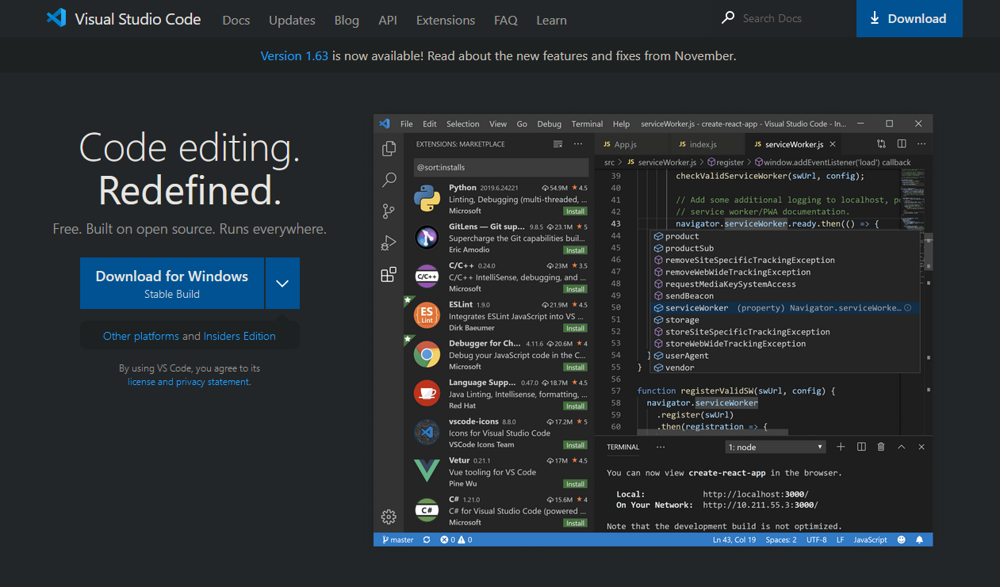

# Week 2 Lab Report: Remote Access

## 1. Installing Visual Studio Code
For the purposes of this tutorial, we will use Microsoft Visual Studio Code (VScode for short) as our work environment. To download it, use [this link](https://code.visualstudio.com/) which will take you to the website for VScode, which should like like this:

Download the applicable version for your system, and then install it. Make sure to also [install the Java JDK](https://www.oracle.com/java/technologies/downloads/). Upon opening a Java file in VScode, it may prompt you to install recommended addons, which you can install at this time. Your open environment should look something like this:

## 2. Remotely Connecting
Now that you have a working environment to connect from, go to the top bar of VScode and click on the "Terminal" section, and go to "New Terminal":

 Alternatively you can press Ctrl+Shift+`. This will open a new terminal where we can put in commands:

  