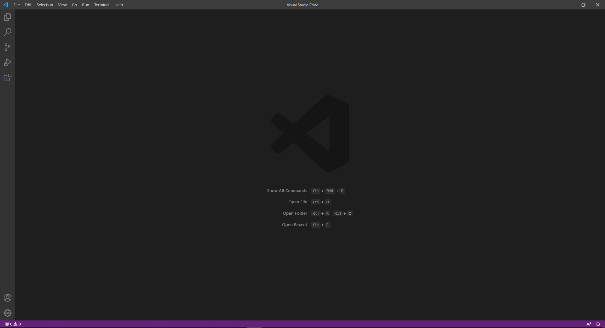
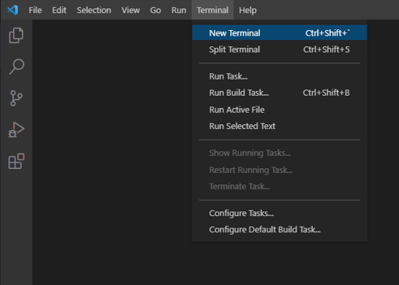
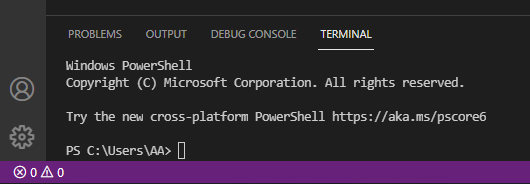
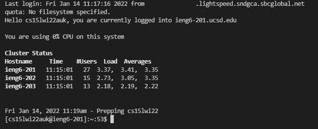
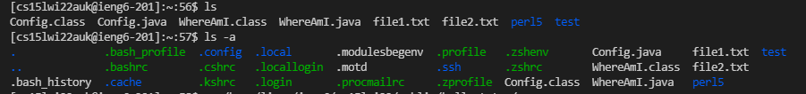

# Week 2 Lab Report: Remote Access

## 1. Installing Visual Studio Code
For the purposes of this tutorial, we will use Microsoft Visual Studio Code (VScode for short) as our work environment. To download it, use [this link](https://code.visualstudio.com/) which will take you to the website for VScode, which should like like this:

Download the applicable version for your system, and then install it. Make sure to also [install the Java JDK](https://www.oracle.com/java/technologies/downloads/). Upon opening a Java file in VScode, it may prompt you to install recommended addons, which you can install at this time. Your open environment should look something like this:

## 2. Remotely Connecting
Now that you have a working environment to connect from, go to the top bar of VScode and click on the "Terminal" section, and go to "New Terminal":

 Alternatively you can press Ctrl+Shift+`. This will open a new terminal where we can put in commands:

  

 Before you can connect remotely, you will need to ensure you have installed a program called [OpenSSH](https://docs.microsoft.com/en-us/windows-server/administration/openssh/openssh_install_firstuse). In addition, you will need to access course specific CS15L account, which you can setup up [here](https://sdacs.ucsd.edu/~icc/index.php). Your account name should be in a similar format to "cs15lwi22zz@ieng6.ucsd.edu".

 Now try to enter the following command (replacing the account name with your own):

    > ssh cs15lwi22zz@ieng6.ucsd.edu

You may be prompted with a message stating that the authenticity of the host cannot be established. Since this is your first time connecting, you can type "yes". Now enter your account password (you set this when getting your account). For privacy reasons, the terminal will show no input as you type. You should see something like this:

## 3. Trying Some Commands
Now that you are connected to the server, you can try running some commands. Useful ones to try could include:

* >cd
* >cd ~
* >ls
* >ls -a
* >ls -lat

You can see what different parts of commands do. For example, you can see the differences between "ls" and "ls -a" here:

*Either Ctrl+D or typing  > `exit` will close the connection to the server

## 4. Moving files with scp