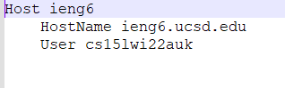
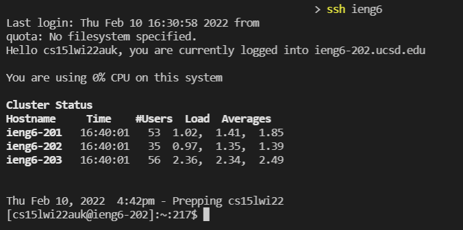
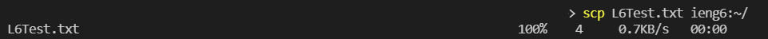

# Streamlining SSH Configuration

While we are used to typing out ``ssh [username]`` in order to remotely connect to ieng6, we can streamline the process to make it even simpler.

You can create/modify a file in your .ssh directory called "config"; in my case, I used Notepad++, but you should be able to open and edit the file with most text editors. In the file, add the following text (of course putting your username in place of the one in the image):

* Replacing "ieng6" with another word on the first line will change the alias login name

Now we can just type ``ssh ieng6`` (replace "ieng6" if you replaced it on the first line of your config file) to login:

In addition, we can use ieng6 in place of our full username in other locations as well. For example, directly copying a file to ieng6 is now much simpler:

