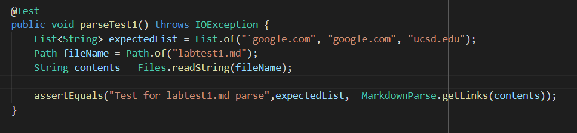

# Week 8 Lab Report: MarkdownParse Implementation Testing

Repositories:
* [Personal](https://github.com/AAP127/markdown-parse)
* [Peer-Review](https://github.com/BenX-64/markdown-parse)


*Additional JUnit tests for new test cases put into `MarkdownParseTest2.java` to seperate them from other cases.

## Code Snippet 1

```
`[a link`](url.com)

[another link](`google.com)`

[`cod[e`](google.com)

[`code]`](ucsd.edu)

```

Given the above test case, VS Code and CommonMark recognize the links:

```
* `google.com
*  google.com
*  ucsd.edu
```

To test for correct MarkdownParse program functionality, I created the following JUnit test:




