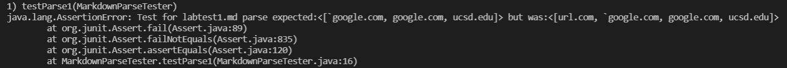
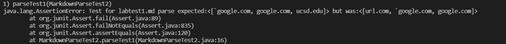
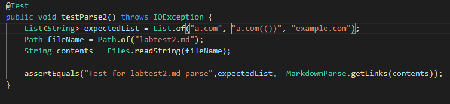
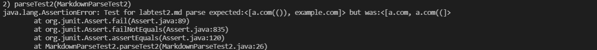
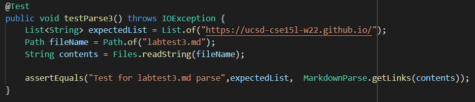
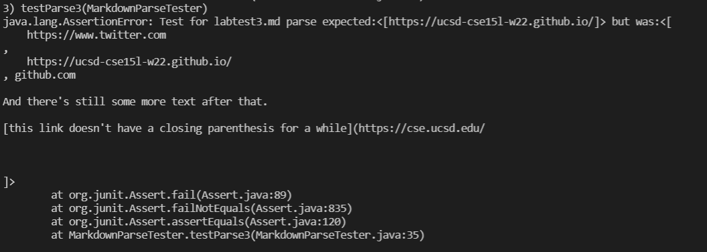
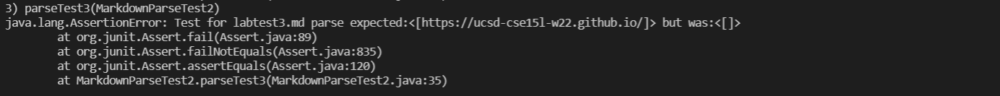

# Week 8 Lab Report: MarkdownParse Implementation Testing

Repositories:
* [Personal](https://github.com/AAP127/markdown-parse)
* [Peer-Review](https://github.com/BenX-64/markdown-parse)


*Additional JUnit tests for new test cases put into `MarkdownParseTester.java` and `MarkdownParseTest2.java` to seperate them from other cases.

## Code Snippet 1

```
`[a link`](url.com)

[another link](`google.com)`

[`cod[e`](google.com)

[`code]`](ucsd.edu)

```

Given the above test case, VS Code and CommonMark recognize the links:

```
* `google.com
*  google.com
*  ucsd.edu
```

To test for correct MarkdownParse program functionality, I created the following JUnit test:


Upon running the test on my markdown-parse repository, the test failed:



When running the test on the other group's markdown-parse repository, it too failed:




-For inline comments and backticks, I think I could make a small change to properly parse the text. In this case, the only discrepancy was with the first line improperly being registered as a link; this happened since the left bracket was commented. My program could account for this by checking if the bracket is plain text, or inside a comment/ code block. If it were to find the bracket inside a comment, it could skip to the next left bracket.


## Code Snippet 2

```
[a [nested link](a.com)](b.com)

[a nested parenthesized url](a.com(()))

[some escaped \[ brackets \]](example.com)

```

Given the above test case, VS Code and CommonMark recognize the links:

```
*  a.com
*  a.com(())
*  example.com
```

To test for correct MarkdownParse program functionality, I created the following JUnit test:



Upon running the test on my markdown-parse repository, the test failed:


When running the test on the other group's markdown-parse repository, it failed:



-For dealing with nested parenthesis, brackets, and escaped brackets, my program struggled with nesting parenthesis, specifically with parsing `a.com(())`. This could be fixed by having the program check for left parenthesis after the first one it finds. It could count to ensure they are evenly matched, as opposed to stopping the markdown segment immediately after finding a right parenthesis. I think this could be achieved as a small addition if done efficiently, though it may be a bit more intesive to incorporate, as other variables and counters are required.

## Code Snippet 3

```
[this title text is really long and takes up more than 
one line

and has some line breaks](
    https://www.twitter.com
)

[this title text is really long and takes up more than 
one line](
    https://ucsd-cse15l-w22.github.io/
)


[this link doesn't have a closing parenthesis](github.com

And there's still some more text after that.

[this link doesn't have a closing parenthesis for a while](https://cse.ucsd.edu/


)

And then there's more text

```

Given the above test case, VS Code and CommonMark recognize the link:

```
* https://ucsd-cse15l-w22.github.io/
```

To test for correct MarkdownParse program functionality, I created the following JUnit test:



Upon running the test on my markdown-parse repository, the test failed:



When running the test on the other group's markdown-parse repository, it also failed:




-For handling newlines, I think the changes would be more complex than 10 lines; in this case I believe not handling newlines caused the program to "parse" the signficant amount of text seen. For the website name, newline characters shouldn't exist and for the link, it can only consist of one newline with the website name and no other text. The website name [between the brackets] could be checked to ensure it doesn't contain any newline characters. As for the link, it has to be checked for no newlines, along with ensuring there are no spaces between characters. Like the previous case, if done very efficiently, the changes could likely be implemented in 10 or less lines; my main concerns would just be since there would be multiple cases/conditions to check.