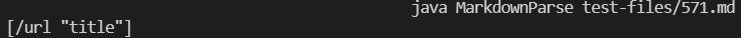

# Week 10 Lab Report: MarkdownParse Implementation Differences

* To understand the differences between my implementation and the instructors' implementation of markdown-parse, I ran a bash script which parsed all 652 files, and then saved the results to a file, for both implementations. 

* I originally used `diff` to determine the differences between these files, however ran into discrepancies in file formatting. For the following output differences, I ended up just manually searching for differences, using `diff` to give me an idea of generally where they might be.


## Output Difference 1: `571.md`
In the instructors' implementation, test file 571 returns as an empty list:


My implementation returns a list containing `[/url "title"]`:



The file's actual contents are as follows:

```

```

Given the break within the "url" section of the link, this is an invalid link, and MarkdownParse should return an empty list when parsing this file. In this case, the instructors' implementation was correct.

In my implementation, my code only checks if the bracketing arrangement is correct to add a link. However, I could add another section to trim the potential link and ensure it doesn't contain a space inside the text. This could be a condition checked alongside the bracket formatting on line 61 in my code (shown in the image below):


Checking for a space within the link text (inside the parenthesis) would prevent my implementation from registering this file (or other files with spaces in the link text) as valid links.


## Output Difference 2: `495.md`
In the instructors' implementation, test file 495 returns a list containing `[foo(and(bar))]`:


My implementation returns a list containing `[foo(and(bar]`:


The file's actual contents are as follows:

```
[link](foo(and(bar)))
```

Given that the file has valid formatting, we should expect `495.md` to return a non-empty list, which both implementations do. The difference occurs regarding preservation of the close parenthesis. In this case, we should expect to have matching open and close parenthesis in the link, as they are between the outer set; commonmark also expects this behavior. In this case, the instructors' implementation was more accurate, as it preserved all link contents between the outer parenthesis set

In my implementation, my code immediately stops parsing the potential link when it hits a close parenthesis. To correct its functionality, I could implement a counter to determine whether to continue or stop parsing; this counter would increment upon finding an open parenthesis after the first one. If the program finds a close parenthesis and the counter is greater than 0, it would decrement the counter and continue parsing past said parenthesis. Following this, if another end condition is met, the link will not be added; finding a newline alongside other characters would be an example of an end condition.


* This would be the relevant section to make the afforementioned changes in my implementation. The counter could be created after line 51, and the logic to continue or finish parsing could be implemented before line 53.

Implementing this parenthesis-checking system would allow my program to not stop before a link is actually finished, leading to proper link parsing.