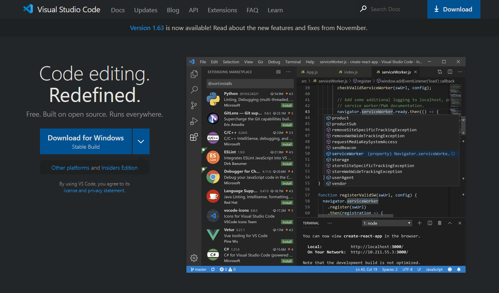
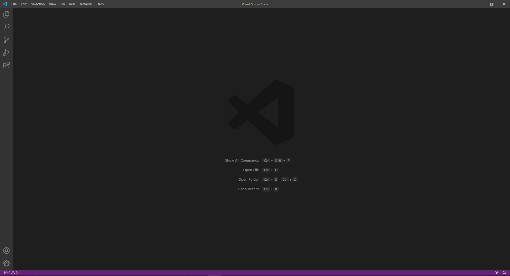
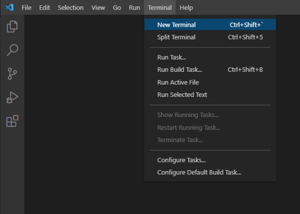
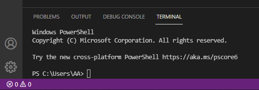
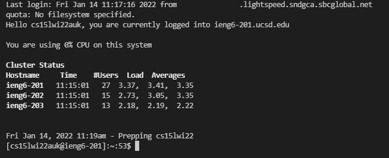
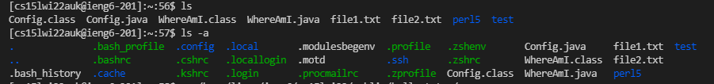
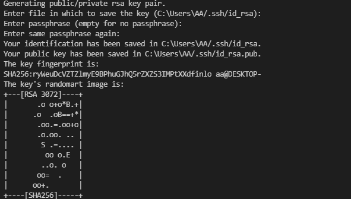
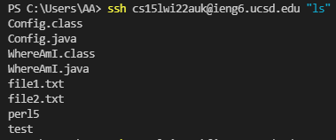
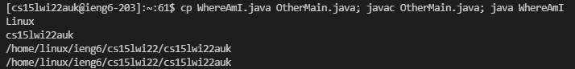

# Week 2 Lab Report: Remote Access
**Formatting inspired by original Lab 1 writeup

## 1. Installing Visual Studio Code
For the purposes of this tutorial, we will use Microsoft Visual Studio Code (VScode for short) as our work environment. To download it, use [this link](https://code.visualstudio.com/) which will take you to the website for VScode, which should like like this:



Download the applicable version for your system, and then install it. Make sure to also [install the Java JDK](https://www.oracle.com/java/technologies/downloads/) for later use. Upon opening a Java file in VScode, it may prompt you to install recommended addons, which you can install at this time. Your open environment should look something like this:



## 2. Remotely Connecting
Now that you have a working environment to connect from, go to the top bar of VScode and click on the "Terminal" section, and go to "New Terminal":




 Alternatively you can press Ctrl+Shift+`. This will open a new terminal where we can put in commands:

  

 Before you can connect remotely, you will need to ensure you have installed a program called [OpenSSH](https://docs.microsoft.com/en-us/windows-server/administration/openssh/openssh_install_firstuse). In addition, you will need to access your course specific CS15L account, which you can set up [here](https://sdacs.ucsd.edu/~icc/index.php). Your account name should be in a similar format to "cs15lwi22zz@ieng6.ucsd.edu".

 Now try to enter the following command in the terminal (replacing the account name with your own):

    > ssh cs15lwi22zz@ieng6.ucsd.edu

You may be prompted with a message stating that the authenticity of the host cannot be established. Since this is your first time connecting, you can type "yes". Now enter your account password (you set this when getting your account). For privacy reasons, the terminal will show no input as you type. You should see something like this after logging in:



*The ssh command, followed by your account name is how you will log in.

## 3. Trying Some Commands
Now that you are connected to the server, you can try running some commands. Useful ones to try could include:

* >cd
* >cd ~
* >ls
* >ls -a
* >ls -lat

You can see what different parts of commands do. For example, you can see the differences between "ls" and "ls -a" here:



*Either Ctrl+D or typing  `exit` will close the connection to the server

## 4. Moving files with scp
Now that you have tried out some commands on the server, we can now move on to transferring files to it. Create a file called `WhereAmI.java` with these contents:

```
class WhereAmI {
  public static void main(String[] args) {
    System.out.println(System.getProperty("os.name"));
    System.out.println(System.getProperty("user.name"));
    System.out.println(System.getProperty("user.home"));
    System.out.println(System.getProperty("user.dir"));
  }
}
```

Using `javac` and `java`, run the file on your computer and note the output. Then in the terminal, run this command to transfer the file to ieng6:

    scp WhereAmI.java cs15lwi22zz@ieng6.ucsd.edu:~/

You should be prompted to enter your password and the transfer will look something like this:


Now log back into ieng6 and type `ls` ; you should see that the file is now on the server. Run it on ieng using `javac` and `java`, and compare the output with that of your local machine.

*`scp` is used to transfer files using SSH.

## 5. Setting up an SSH Key
In order to log on to ieng6 without always typing in a password, we can generate a public-private key pair. Type `ssh-keygen` into your console and you should see something like this:



*Follow [these extra steps](https://docs.microsoft.com/en-us/windows-server/administration/openssh/openssh_keymanagement#user-key-generation) before continuing, if you are on Windows.

Now we need to copy the public key to ieng6 by running these commands (using your account username)

    > ssh cs15lwi22zz@ieng6.ucsd.edu
        (Enter Password)
    > mkdir .ssh
        (Logout from ieng6)
    > scp /Users/USERNAME/.ssh/id_rsa.pub cs15lwi22@ieng6.ucsd.edu:~/.ssh/authorized_keys
        
    *Replace USERNAME with your local computer account username

Now you should be able to `ssh` or `scp` from this client to ieng6 without entering your password.

## 6. Optimizing Remote Running
To help you save time while running commands and editing files, you can run commands remotely and multiple at a time.

By entering `ssh cs15lwi22@ieng6.ucsd.edu "COMMAND"` (using your account), you can run a command on ieng6 from your client without first logging in. An example would look like this:



In addition, you can run multiple commands together using semicolons. For example, running `cp WhereAmI.java OtherMain.java; javac OtherMain.java; java WhereAmI` yields the following result:



*A helpful note: 
Pressing the up arrow in your terminal can allow you to recall previous commands. After saving a local file, you can upload, compile, and run it in around 6 keystrokes!

