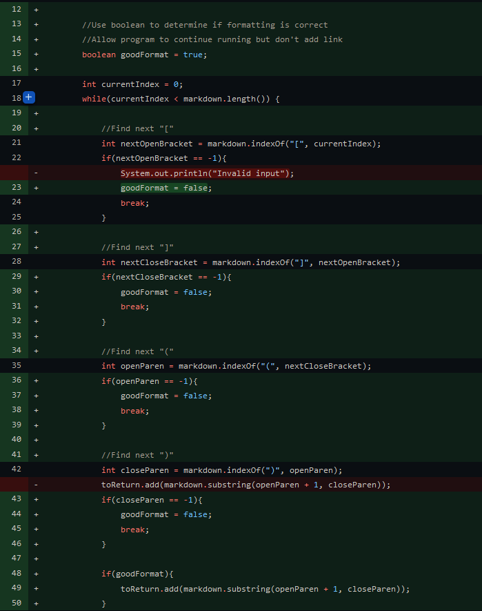
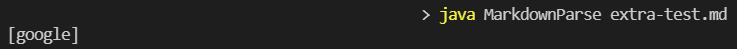
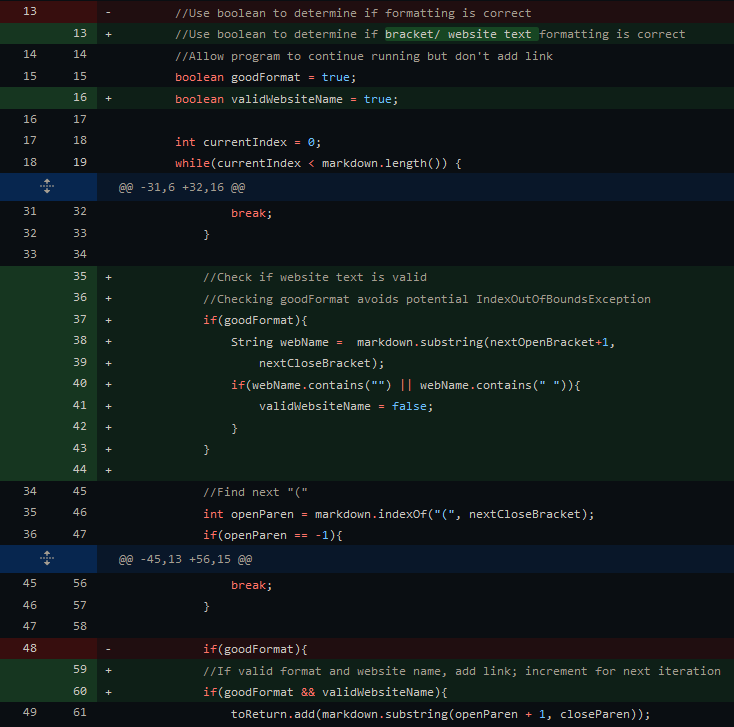

# Week 4 Lab Report: Testing and Debugging

## Code Change 1
Failure inducing input: [test-file2.md](https://github.com/AAP127/markdown-parse/blob/main/test-file2.md)

The first major code change occurred to account for MarkdownParse.java returning no output when running on test-file2.md. The program would freeze when trying to parse the file, likely due to it's incorrect formatting.

Upon printing the value of `nextCloseBracket`, we saw that "-1" was constantly being printed to the terminal, leading us to suspect something was causing an infinite loop.

To allow the program to account for the formatting of test-file2.md, we added a statement to check if a left bracket can be found; the program with inform the user of invalid input.

*Changes can be found on "Accounted for missing right bracket" commit. Extra description in comments.

The main issue with this test case was that the improper formatting, missing a right bracket, led the program to hang trying to find it. The "bug" of the program- it requires a rigid structure- meant that this situation would lead the program to give no response when running test-file2.md. 

## Code Change 2
Failure inducing input: [test-file2.md](https://github.com/AAP127/markdown-parse/blob/main/test-file2.md)

After changing the code to not completely stall MarkdownParse.java, it would run test-file2.md, but still had some problematic results, showing up as incorrect output; the program would simultaneously display failure and success.

What we realized is that, due to only requiring the left and right parenthesis in the correct spot, the program was able to still parse the link. This caused two sets of output, one claiming the input was invalid, yet the other showing normal functionality. To fix this, the program now checks that all characters (the two brackets and parenthesis) exist to add a link.

*Changes can be found on "CheckMarkdownParse formatting" commit. Extra description in commit.

In this case, the bug was that the program continued running after finding input to be invalid. As mentioned above, the link in test-file2.md had both parenthesis, allowing it to still be parsed after being deemed invalid. This led to the program printing two seperate statements, one for registering a bad input, and another for returning a link. The program now returns an empty list, which is expected when no link in a valid format is found.

## Code Change 3
Failure inducing input: [extra-test.md](https://github.com/AAP127/markdown-parse/blob/main/extra-test.md)

Another test to try again involved invalid formatting, but changing the input to where the website name is missing, and the link is not a full link. 

* When text is present in place of a link, the text can still be part of a link. However, since location depends on the location of the markdown file, the program will only return the portion of the link contained within the markdown file. For example, a markdown file in a folder called "testFolder" containing  "`[Website](testLink)`" would redirect to   "`...\testFolder\testLink`". The program would return "testLink" in this case.

One issue came up when a file would have no website name, but had a link/text in the link section, like extra-test.md. 

Since the website name section is empty, the program should return an empty list, however it still parses the text/ link since the brackets and parenthesis are in place. So fix this, the program requires text to exist between the left and right brackets.

*Changes can be found on "Update extra-test.md and MDP.java" commit. Extra description in commit.

For this case, not checking for a valid website name allowed a link without a corresponding website name to be added to the list and displayed. By checking that the website name, the program is able to accept website names that a markdown file would register to be valid.

**One small issue with the current implementation revolves around checking for a string containing a space. This is to prevent an attempt at making the website name only spaces. However, it also means that a user cannot use a space, even in a valid name. Creating a more robust method of detecting invalid website names could be an area of future development for the program.