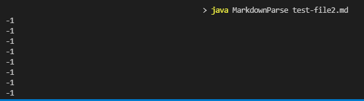
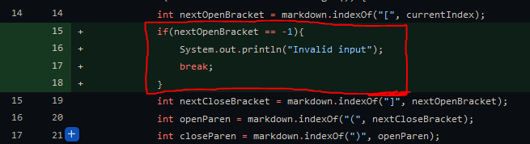
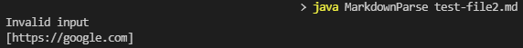
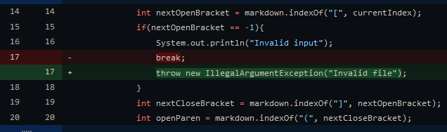
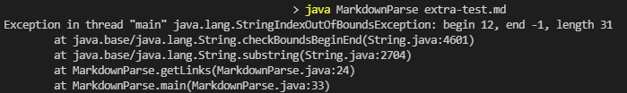
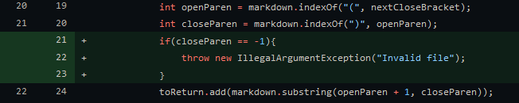

# Week 4 Lab Report: Testing and Debugging

## Code Change 1
Failure inducing input: https://github.com/AAP127/markdown-parse/blob/main/test-file2.md

The first major code change occurred to account for MarkdownParse.java returning no output when running on test-file2.md. The program would freeze when trying to parse the file, likely due to it's incorrect formatting.

Upon printing the value of `nextCloseBracket`, we saw that "-1" was constantly being printed to the terminal, leading us to suspect something was causing an infinite loop.

To allow the program to account for the formatting of test-file2.md, we added a statement to check if a left bracket can be found; the program with inform the user of invalid input.

*Changes can be found on "Accounted for missing right bracket" commit. Extra description in comments.

The main issue with this test case was that the improper formatting, missing a right bracket, led the program to hang trying to find it. The "bug" of the program- it requires a rigid structure- meant that this situation would lead the program to give no response when running test-file2.md. 

## Code Change 2
Failure inducing input: https://github.com/AAP127/markdown-parse/blob/main/test-file2.md

After changing the code to not completely stall MarkdownParse.java, it would run test-file2.md, but still had some problematic results, showing up as incorrect output.

What we realized is that, due to only requiring the left and right parenthesis in the correct spot, the program was able to still parse the link. This caused two sets of output, one claiming the input was invalid, yet the other showing normal functionality. To fix this, we decided that this situation should throw an IllegalArgumentException, specifically when nextOpenBracket wasn't found.

*Changes can be found on "Added new tests" commit. Extra description in comments.

In this case, the bug was that the program continued running after finding input to be invalid. As mentioned above, the link in test-file2.md had both parenthesis, allowing it to still be parsed after being deemed invalid. This led to the program printing two seperate statements.

## Code Change 3
Failure inducing input: https://github.com/AAP127/markdown-parse/blob/main/extra-test.md

Another test to try again involved invalid formatting, but changing the input to where the right parenthesis is missing; this condition is present in extra-test.md. Running MarkdownParse.java with extra-test.md crashes the program with a StringIndexOutOfBoundsException:

Since the right parenthesis is missing, `closeParen` will not be found, and will equal -1. By throwing an exception, the program is prevented from accessing -1 as an index.

*Changes can be found on "Allow program to deal with missing right parenthesis " commit. Extra description in commit.

For this case, the input not having the closing parenthesis for the link led to the program trying to access -1 as an index. Once again, the program was not equipped to handle input in this format, causing the StringIndexOutOfBoundsException.

